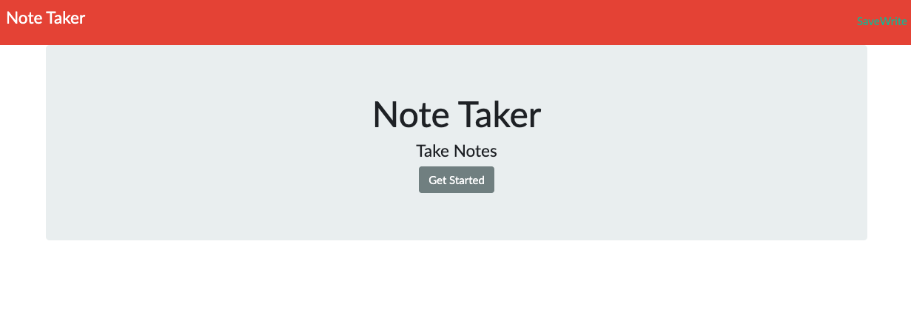
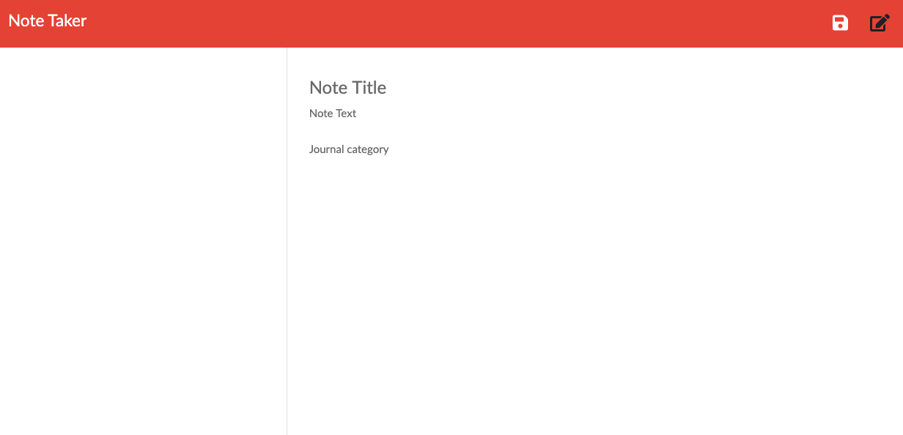

# note-taker
# Unit 11 Express Homework: Note Taker

## Description

An application that can be used to write, save, and delete notes. This application uses an express backend and save and retrieve note data from a file.

Heroku link: https://note-taker-01.herokuapp.com

